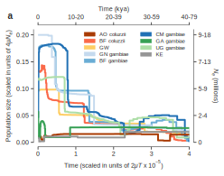
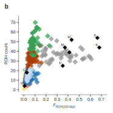

## Test figures from image sources {.page_break_before}

- May need to use `secno=1` on all figures, e.g. `{#fig:id secno=1}` to avoid mislabelling/miscounting bug? https://github.com/tomduck/pandoc-fignos/issues/76

### 1) Separate figures with alt text ("captions"), no resizing, refs linked by default {.page_break_before}

{#fig:figure-test-1a}

{#fig:figure-test-1b}


**{@fig:figure-test-1a}**, Stairway plot of changes in population size over time. Absolute values of time and Ne are shown on alternative axes as a range of values, assuming lower and upper limits for the mutation rate μ as 2.8 × 10−9 and 5.5 × 10−9, respectively, and t = 11 generations per year. ka, thousand years ago. **{@fig:figure-test-1b}**, Runs of homozygosity (ROH) in individual mosquitoes, highlighting recent inbreeding in Kenyan (grey) and colony (black) mosquitoes. G, Ghana; K, Kisumu; M, Mali; P, Pimperena.

- The "Figure {n}:" label before the alt text "captions", e.g. Figure {@fig:figure-test-1b}{nolink=True}s: ROH Scatter Plot, is added automatically.
- Btw, `{@fig:figure-test-1b}` appears as `{???}`: when in "quotes", e.g. "{@fig:figure-test-1b}", which is unexpected, possibly a bug
- Curly brackets are to separate fig ref from adjacent non-whitespace strings, e.g. `@fig:figure-test-1b-` versus `{@fig:figure-test-1b}-`


### 2) Separate figures with no alt text (no "captions"), no resizing, refs linked by default {.page_break_before}

{#fig:figure-test-2a}

{#fig:figure-test-2b}


**{@fig:figure-test-2a}**, Stairway plot of changes in population size over time. Absolute values of time and Ne are shown on alternative axes as a range of values, assuming lower and upper limits for the mutation rate μ as 2.8 × 10−9 and 5.5 × 10−9, respectively, and t = 11 generations per year. ka, thousand years ago. **{@fig:figure-test-2b}**, Runs of homozygosity (ROH) in individual mosquitoes, highlighting recent inbreeding in Kenyan (grey) and colony (black) mosquitoes. G, Ghana; K, Kisumu; M, Mali; P, Pimperena.

- The "Figure {n}:" label before the empty alt text "captions", e.g. Figure {@fig:figure-test-2b}{nolink=True}:, is added automatically.
  - Want a way to override this label's template
- The colon after the Figure {@fig:figure-test-2b}{nolink=True}:, which anticipates text, looks odd/confusing when there is no text. It looks like it applies to the content that follows after that label, but it doesn't/shouldn't.


### 3) Separate subfigures using [Pandoc "divs"](https://pandoc.org/MANUAL.html#divs-and-spans), with no alt text, no layout, no resizing {.page_break_before}

::: {#fig:figure-test3 secno=1}

**Figure @fig:figure-test3{nolink=True}**


:::


**a**, Stairway plot of changes in population size over time. Absolute values of time and Ne are shown on alternative axes as a range of values, assuming lower and upper limits for the mutation rate μ as 2.8 × 10−9 and 5.5 × 10−9, respectively, and t = 11 generations per year. ka, thousand years ago. **b**, Runs of homozygosity (ROH) in individual mosquitoes, highlighting recent inbreeding in Kenyan (grey) and colony (black) mosquitoes. G, Ghana; K, Kisumu; M, Mali; P, Pimperena.

- Pandoc divs let you group content under one Manubot figure reference, in this case two simple images (not Manubot figures in their own right)
- Putting the Markdown for the figures on separate paragraphs (as required by Pandoc) causes a vertical layout by default, which is undesirable here 
- Figure references for **{@fig:figure-test3}a** and **{@fig:figure-test3}b** are just references/links to **{@fig:figure-test3}** plus manually managed suffixes
- Can switch off the link for figure references, e.g. `@fig:figure-test3{nolink=True}` gives @fig:figure-test3{nolink=True} rather than @fig:figure-test3
- The figure label was added in manually, i.e. `**Figure @fig:figure-test3{nolink=True}**`, otherwise there would be no visible label for this figure, even though it has a reference
- Note `figure-test3` has reset to "1", rather than {@fig:figure-test-2b} + 1. Bug? https://github.com/tomduck/pandoc-fignos/issues/76
  - Using `secno=1` here, i.e. `{#fig:figure-test3 secno=1}` has made no difference, but perhaps need to use `secno=1` on **all** figures in order to workaround. (?!)

### 4) Breaking of pandoc-fignos when figures are not in their own Markdown paragraph {.page_break_before}

{#fig:figure-test4a}
{#fig:figure-test4b}

**@fig:figure-test4a{nolink=True}**, Stairway plot of changes in population size over time. Absolute values of time and Ne are shown on alternative axes as a range of values, assuming lower and upper limits for the mutation rate μ as 2.8 × 10−9 and 5.5 × 10−9, respectively, and t = 11 generations per year. ka, thousand years ago. **@figure-test4b{nolink=True}**, Runs of homozygosity (ROH) in individual mosquitoes, highlighting recent inbreeding in Kenyan (grey) and colony (black) mosquitoes. G, Ghana; K, Kisumu; M, Mali; P, Pimperena.

- See broken refs as "??" and `???{nolink=True}`.
- Reports errors:
  - `pandoc-fignos: Bad reference: @fig:figure-test4a.`
  -  `Generating csl_item for 'figure-test3b' failed due to a NotImplementedError: Manubot does not know how to generate a csl_item for 'figure-test3b'`

Pandoc requires:
```
{#fig:figure-test4a}

{#fig:figure-test4b}
```

Instead of the above:
```
{#fig:figure-test4a}
{#fig:figure-test4b}
```

- This constraint prevents figures from being placed next to eachother by a simple inline method (as above) without breaking the managed references.


### 5) Separate figures with HTML table-based layout, with tags, no alt text, no resizing {.page_break_before}

<table>
<tr>
<td style="border: none">

{#fig:figure-test5a tag="a"}

</td>
<td style="border: none">

{#fig:figure-test5b tag="b"}

</td>
</tr>
</table>

**@fig:figure-test5a{nolink=True}**, Stairway plot of changes in population size over time. Absolute values of time and Ne are shown on alternative axes as a range of values, assuming lower and upper limits for the mutation rate μ as 2.8 × 10−9 and 5.5 × 10−9, respectively, and t = 11 generations per year. ka, thousand years ago. **@fig:figure-test5b{nolink=True}**, Runs of homozygosity (ROH) in individual mosquitoes, highlighting recent inbreeding in Kenyan (grey) and colony (black) mosquitoes. G, Ghana; K, Kisumu; M, Mali; P, Pimperena.

- If the HTML contains any preceding whitespace in the markup, e.g. indentation, you will see broken HTML markup
- HTML table-based layout could be used to place the figures next to each other while still meeting the Pandoc separate-paragraph rule, but it's a bit of a hack
- Table cell borders removed using `<td style="border: none">`
- Manubot shows a figure label for each figure, even when no alt/caption text. Here the figure label/number is overidden usign specified "tags"
- Tags can be used to override the automatic managed figure number, e.g. here `@fig:figure-test5a` is labelled as "a" instead of an automatically incremented figure number. In other words, normally the figure label would be a number, which would be incremented automatically, except for bug/feature: https://github.com/tomduck/pandoc-fignos/issues/76, but here we have overridden that figure label.
- Again, the colon after the figure label, which anticipates text, looks odd/confusing when there is no text. It looks like it applies to the content that follows after that label, but it doesn't/shouldn't.

### 6) Breaking of separate figures with Markdown table-based layout, no alt text, no resizing {.page_break_before}

|   |   |
| --- | --- |
| {#fig:figure-test6a} | {#fig:figure-test6b} |

**@fig:figure-test6a{nolink=True}**, Stairway plot of changes in population size over time. Absolute values of time and Ne are shown on alternative axes as a range of values, assuming lower and upper limits for the mutation rate μ as 2.8 × 10−9 and 5.5 × 10−9, respectively, and t = 11 generations per year. ka, thousand years ago. **@fig:figure-test6b{nolink=True}**, Runs of homozygosity (ROH) in individual mosquitoes, highlighting recent inbreeding in Kenyan (grey) and colony (black) mosquitoes. G, Ghana; K, Kisumu; M, Mali; P, Pimperena.

- See broken figure references as "??", and no figure labels under the figures, compared to (5)
  - Generates errors `pandoc-fignos: Bad reference: @fig:figure-test6a.` and `pandoc-fignos: Bad reference: @fig:figure-test6b.`
- Want to remove visible table cell borders
- Markdown table-based layout cannot be used to place the figures next to each other without breaking the Pandoc separate-paragraph rule


### 7) Separate figures using images inline (not Manubot figures), no resizing {.page_break_before}


**a**, Stairway plot of changes in population size over time. Absolute values of time and Ne are shown on alternative axes as a range of values, assuming lower and upper limits for the mutation rate μ as 2.8 × 10−9 and 5.5 × 10−9, respectively, and t = 11 generations per year. ka, thousand years ago. **b**, Runs of homozygosity (ROH) in individual mosquitoes, highlighting recent inbreeding in Kenyan (grey) and colony (black) mosquitoes. G, Ghana; K, Kisumu; M, Mali; P, Pimperena.

- images can be used to simulate figures, at the cost of all the figure management features of Manubot (assuming the features worked as intended)
- references for figures would have to be managed manually. A figure reference has not been added here, and would have to be added and maintained manually (outside of Manubot's system, by hard-coding the figure identifier/label, e.g. Figure 1, in the Markdown)


### 8) Separate figures using images inline (not Manubot figures), resized to 3in and 4in width, rearranged {.page_break_before}

{width="4in"}
{width="3in"}

**a**, Stairway plot of changes in population size over time. Absolute values of time and Ne are shown on alternative axes as a range of values, assuming lower and upper limits for the mutation rate μ as 2.8 × 10−9 and 5.5 × 10−9, respectively, and t = 11 generations per year. ka, thousand years ago. **b**, Runs of homozygosity (ROH) in individual mosquitoes, highlighting recent inbreeding in Kenyan (grey) and colony (black) mosquitoes. G, Ghana; K, Kisumu; M, Mali; P, Pimperena.

- Labels **a** and **b** in the description are manually coded (these are not Manubot-managed figures, only Markdown images)
- See that subfigure **b** appears before (left of) subfigure **a**, intentionally swapped around
- See that the **b** label is larger than the **a** label, because the whole **b** image has been made larger than **a**, intentionally
- embedding subfigure labels in the image means that image resizing and rearranging is frustrated
  - new images would need to be generated with new labels, or the SVG code modified by hand


### 9) Separate figures using images (not Manubot figures) with HTML table-based layout, resized to 3in and 4in width {.page_break_before}

If the labels were not embedded in the image, the labels would naturally need be added to the Markdown in some way, perhaps as figure "captions".

Imagine that the two images below did not contain their **a** and **b** labels in their top-left corners:

**Figure 42**

<table>
<tr>
<td style="border: none">

{#fig:figure-test9a tag="a" width="3in"}

</td>
<td style="border: none">

{#fig:figure-test9b tag="b" width="4in"}

</td>
</tr>
</table>

**@fig:figure-test9a{nolink=True}**, Stairway plot of changes in population size over time. Absolute values of time and Ne are shown on alternative axes as a range of values, assuming lower and upper limits for the mutation rate μ as 2.8 × 10−9 and 5.5 × 10−9, respectively, and t = 11 generations per year. ka, thousand years ago. **@fig:figure-test9b{nolink=True}**, Runs of homozygosity (ROH) in individual mosquitoes, highlighting recent inbreeding in Kenyan (grey) and colony (black) mosquitoes. G, Ghana; K, Kisumu; M, Mali; P, Pimperena.

- This is similar to (1), except with the layout approach of (5)
- The **@fig:figure-test9a{nolink=True}** and **@fig:figure-test9b{nolink=True}** in the descriptions are taken from the Manubot figure tag labels, specified in Markdown.
- The label **Figure 42** was added manually. Only the subfigure identifiers/labels are managed by Manubot. There is no "Manubot figure 42", so that label would have to be managed/maintained manually.


### 10) Single figure with subfigures as labelled images in a HTML table-based layout {.page_break_before}

Imagine that the following two images do not contain labels **a** and **b** in their top-left corners:

::: {#fig:figure-test10}

**Figure {@fig:figure-test10}{nolink=True}**

<table>
<tr>
<td style="border: none">

**a**


  
</td>
<td style="border: none">

**b**


</td>
</tr>
</table>

:::

**{@fig:figure-test10}{nolink=True}a**, Stairway plot of changes in population size over time. Absolute values of time and Ne are shown on alternative axes as a range of values, assuming lower and upper limits for the mutation rate μ as 2.8 × 10−9 and 5.5 × 10−9, respectively, and t = 11 generations per year. ka, thousand years ago. **{@fig:figure-test10}{nolink=True}b**, Runs of homozygosity (ROH) in individual mosquitoes, highlighting recent inbreeding in Kenyan (grey) and colony (black) mosquitoes. G, Ghana; K, Kisumu; M, Mali; P, Pimperena.


- This is similar to (3), except with the layout approach of (5)
- The label **Figure {@fig:figure-test10}{nolink=True}** was added manually, but the {@fig:figure-test10}{nolink=True} part is automatic.
- The subfigure labels **a** and **b** outside the image were added manually.
- In the description, the {@fig:figure-test10}{nolink=True} part (of {@fig:figure-test10}{nolink=True}a and {@fig:figure-test10}{nolink=True}b) is automatic, whereas the "a" and "b" parts are added manually, i.e. hard-coded in the Markdown.

