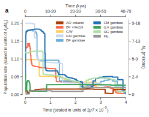

---
author-meta:
- John Doe
- Jane Roe
bibliography:
- content/manual-references.json
date-meta: '2020-06-23'
header-includes: '<!--

  Manubot generated metadata rendered from header-includes-template.html.

  Suggest improvements at https://github.com/manubot/manubot/blob/master/manubot/process/header-includes-template.html

  -->

  <meta name="dc.format" content="text/html" />

  <meta name="dc.title" content="Manuscript Title" />

  <meta name="citation_title" content="Manuscript Title" />

  <meta property="og:title" content="Manuscript Title" />

  <meta property="twitter:title" content="Manuscript Title" />

  <meta name="dc.date" content="2020-06-23" />

  <meta name="citation_publication_date" content="2020-06-23" />

  <meta name="dc.language" content="en-US" />

  <meta name="citation_language" content="en-US" />

  <meta name="dc.relation.ispartof" content="Manubot" />

  <meta name="dc.publisher" content="Manubot" />

  <meta name="citation_journal_title" content="Manubot" />

  <meta name="citation_technical_report_institution" content="Manubot" />

  <meta name="citation_author" content="John Doe" />

  <meta name="citation_author_institution" content="Department of Something, University of Whatever" />

  <meta name="citation_author_orcid" content="XXXX-XXXX-XXXX-XXXX" />

  <meta name="twitter:creator" content="@johndoe" />

  <meta name="citation_author" content="Jane Roe" />

  <meta name="citation_author_institution" content="Department of Something, University of Whatever" />

  <meta name="citation_author_institution" content="Department of Whatever, University of Something" />

  <meta name="citation_author_orcid" content="XXXX-XXXX-XXXX-XXXX" />

  <link rel="canonical" href="https://malariagen.github.io/manubot-test/" />

  <meta property="og:url" content="https://malariagen.github.io/manubot-test/" />

  <meta property="twitter:url" content="https://malariagen.github.io/manubot-test/" />

  <meta name="citation_fulltext_html_url" content="https://malariagen.github.io/manubot-test/" />

  <meta name="citation_pdf_url" content="https://malariagen.github.io/manubot-test/manuscript.pdf" />

  <link rel="alternate" type="application/pdf" href="https://malariagen.github.io/manubot-test/manuscript.pdf" />

  <link rel="alternate" type="text/html" href="https://malariagen.github.io/manubot-test/v/5faecccf2b69867f77742b4ef0ba39801688590d/" />

  <meta name="manubot_html_url_versioned" content="https://malariagen.github.io/manubot-test/v/5faecccf2b69867f77742b4ef0ba39801688590d/" />

  <meta name="manubot_pdf_url_versioned" content="https://malariagen.github.io/manubot-test/v/5faecccf2b69867f77742b4ef0ba39801688590d/manuscript.pdf" />

  <meta property="og:type" content="article" />

  <meta property="twitter:card" content="summary_large_image" />

  <link rel="icon" type="image/png" sizes="192x192" href="https://manubot.org/favicon-192x192.png" />

  <link rel="mask-icon" href="https://manubot.org/safari-pinned-tab.svg" color="#ad1457" />

  <meta name="theme-color" content="#ad1457" />

  <!-- end Manubot generated metadata -->'
keywords:
- markdown
- publishing
- manubot
lang: en-US
manubot-clear-requests-cache: false
manubot-output-bibliography: output/references.json
manubot-output-citekeys: output/citations.tsv
manubot-requests-cache-path: ci/cache/requests-cache
title: Manuscript Title
...


<small><em>
This manuscript
([permalink](https://malariagen.github.io/manubot-test/v/5faecccf2b69867f77742b4ef0ba39801688590d/))
was automatically generated
from [malariagen/manubot-test@5faeccc](https://github.com/malariagen/manubot-test/tree/5faecccf2b69867f77742b4ef0ba39801688590d)
on June 23, 2020.
</em></small>

## Authors


+ **John Doe**<br>
    {.inline_icon}
    [XXXX-XXXX-XXXX-XXXX](https://orcid.org/XXXX-XXXX-XXXX-XXXX)
    · {.inline_icon}
    [johndoe](https://github.com/johndoe)
    · {.inline_icon}
    [johndoe](https://twitter.com/johndoe)<br>
  <small>
     Department of Something, University of Whatever
     · Funded by Grant XXXXXXXX
  </small>

+ **Jane Roe**<br>
    {.inline_icon}
    [XXXX-XXXX-XXXX-XXXX](https://orcid.org/XXXX-XXXX-XXXX-XXXX)
    · {.inline_icon}
    [janeroe](https://github.com/janeroe)<br>
  <small>
     Department of Something, University of Whatever; Department of Whatever, University of Something
  </small>


## Abstract {.page_break_before}


This manuscript is a template (aka "rootstock") for [Manubot](https://manubot.org/ "Manubot"), a tool for writing scholarly manuscripts.
Use this template as a starting point for your manuscript.

The rest of this document is a full list of formatting elements/features supported by Manubot.
Compare the input (`.md` files in the `/content` directory) to the output you see below.

## Basic formatting

**Bold** __text__

[Semi-bold text]{.semibold}

[Centered text]{.center}

[Right-aligned text]{.right}

*Italic* _text_

Combined *italics and __bold__*

~~Strikethrough~~

1. Ordered list item
2. Ordered list item
    a. Sub-item
    b. Sub-item
        i. Sub-sub-item
3. Ordered list item
    a. Sub-item

- List item
- List item
- List item

subscript: H~2~O is a liquid

superscript: 2^10^ is 1024.

[unicode superscripts](https://www.google.com/search?q=superscript+generator)⁰¹²³⁴⁵⁶⁷⁸⁹

[unicode subscripts](https://www.google.com/search?q=superscript+generator)₀₁₂₃₄₅₆₇₈₉

A long paragraph of text.
Lorem ipsum dolor sit amet, consectetur adipiscing elit, sed do eiusmod tempor incididunt ut labore et dolore magna aliqua.
Ut enim ad minim veniam, quis nostrud exercitation ullamco laboris nisi ut aliquip ex ea commodo consequat.
Duis aute irure dolor in reprehenderit in voluptate velit esse cillum dolore eu fugiat nulla pariatur.
Excepteur sint occaecat cupidatat non proident, sunt in culpa qui officia deserunt mollit anim id est laborum.

Putting each sentence on its own line has numerous benefits with regard to [editing](https://asciidoctor.org/docs/asciidoc-recommended-practices/#one-sentence-per-line) and [version control](https://rhodesmill.org/brandon/2012/one-sentence-per-line/).

Line break without starting a new paragraph by putting  
two spaces at end of line.

## Document organization

Document section headings:

# Heading 1

## Heading 2

### Heading 3

#### Heading 4

### A heading centered on its own printed page{.center .page_center}

<!-- an arbitrary comment. visible in input, but not visible in output. -->

Horizontal rule:

---

`Heading 1`'s are recommended to be reserved for the title of the manuscript.

`Heading 2`'s are recommended for broad sections such as *Abstract*, *Methods*, *Conclusion*, etc.

`Heading 3`'s and `Heading 4`'s are recommended for sub-sections.

## Links

Bare URL link: <https://manubot.org>

[Long link with lots of words and stuff and junk and bleep and blah and stuff and other stuff and more stuff yeah](https://manubot.org)

[Link with text](https://manubot.org)

[Link with hover text](https://manubot.org "Manubot Homepage")

[Link by reference][manubot homepage]

[Manubot Homepage]: https://manubot.org

## Citations

Citation by DOI [@doi:10.7554/eLife.32822].

Citation by PubMed Central ID [@pmc:PMC6103790].

Citation by PubMed ID [@pubmed:30718888].

Citation by Wikidata ID [@wikidata:Q56458321].

Citation by ISBN [@isbn:9780262517638].

Citation by URL [@https://greenelab.github.io/meta-review/].

Citation by alias [@deep-review].

Multiple citations can be put inside the same set of brackets [@doi:10.7554/eLife.32822; @deep-review; @isbn:9780262517638].
Manubot plugins provide easier, more convenient visualization of and navigation between citations [@doi:10.1371/journal.pcbi.1007128; @pubmed:30718888; @pmc:PMC6103790; @deep-review].

Citation tags (i.e. aliases) can be defined in their own paragraphs using Markdown's reference link syntax:

[@deep-review]: doi:10.1098/rsif.2017.0387

## Referencing figures, tables, equations

Figure @fig:square-image

Figure @fig:wide-image

Figure @fig:tall-image

Figure @fig:vector-image

Table @tbl:bowling-scores

Equation @eq:regular-equation

Equation @eq:long-equation

## Quotes and code

> Quoted text

> Quoted block of text
>
> Two roads diverged in a wood, and I—  
> I took the one less traveled by,  
> And that has made all the difference.

Code `in the middle` of normal text, aka `inline code`.

Code block with Python syntax highlighting:

```python
from manubot.cite.doi import expand_short_doi

def test_expand_short_doi():
    doi = expand_short_doi("10/c3bp")
    # a string too long to fit within page:
    assert doi == "10.25313/2524-2695-2018-3-vliyanie-enhansera-copia-i-insulyatora-gypsy-na-sintez-ernk-modifikatsii-hromatina-i-svyazyvanie-insulyatornyh-belkov-vtransfetsirovannyh-geneticheskih-konstruktsiyah"
```

Code block with no syntax highlighting:

```
Exporting HTML manuscript
Exporting DOCX manuscript
Exporting PDF manuscript
```

## Figures

{#fig:square-image}

{#fig:wide-image}

{#fig:tall-image height=3in}

{#fig:vector-image height=2.5in .white}

## Tables

| *Bowling Scores* | Jane          | John          | Alice         | Bob           |
|:-----------------|:-------------:|:-------------:|:-------------:|:-------------:|
| Game 1 | 150 | 187 | 210 | 105 |
| Game 2 |  98 | 202 | 197 | 102 |
| Game 3 | 123 | 180 | 238 | 134 |

Table: A table with a top caption and specified relative column widths.
{#tbl:bowling-scores}

|         | Digits 1-33                        | Digits 34-66                      | Digits 67-99                      | Ref.                                                        |
|:--------|:-----------------------------------|:----------------------------------|:----------------------------------|:------------------------------------------------------------|
| pi      | 3.14159265358979323846264338327950 | 288419716939937510582097494459230 | 781640628620899862803482534211706 | [`piday.org`](https://www.piday.org/million/)               |
| e       | 2.71828182845904523536028747135266 | 249775724709369995957496696762772 | 407663035354759457138217852516642 | [`nasa.gov`](https://apod.nasa.gov/htmltest/gifcity/e.2mil) |

Table: A table too wide to fit within page.
{#tbl:constant-digits}

|          | **Colors** <!-- $colspan="2" --> |                      |
|:--------:|:--------------------------------:|:--------------------:|
| **Size** | **Text Color**                   | **Background Color** |
| big      | blue                             | orange               |
| small    | black                            | white                |

Table: A table with merged cells using the `attributes` plugin.
{#tbl: merged-cells}

## Equations

A LaTeX equation:

$$\int_0^\infty e^{-x^2} dx=\frac{\sqrt{\pi}}{2}$$ {#eq:regular-equation}

An equation too long to fit within page:

$$x = a + b + c + d + e + f + g + h + i + j + k + l + m + n + o + p + q + r + s + t + u + v + w + x + y + z + 1 + 2 + 3 + 4 + 5 + 6 + 7 + 8 + 9$$ {#eq:long-equation}

## Special

<i class="fas fa-exclamation-triangle"></i> [WARNING]{.semibold} _The following features are only supported and intended for `.html` and `.pdf` exports._
_Journals are not likely to support them, and they may not display correctly when converted to other formats such as `.docx`._

[Link styled as a button](https://manubot.org "Manubot Homepage"){.button}

Adding arbitrary HTML attributes to an element using Pandoc's attribute syntax:

::: {#some_id_1 .some_class style="background: #ad1457; color: white; margin-left: 40px;" title="a paragraph of text" data-color="white" disabled="true"}
Manubot Manubot Manubot Manubot Manubot.
Manubot Manubot Manubot Manubot.
Manubot Manubot Manubot.
Manubot Manubot.
Manubot.
:::

Adding arbitrary HTML attributes to an element with the Manubot `attributes` plugin (more flexible than Pandoc's method in terms of which elements you can add attributes to):

Manubot Manubot Manubot Manubot Manubot.
Manubot Manubot Manubot Manubot.
Manubot Manubot Manubot.
Manubot Manubot.
Manubot.
<!-- $id="element_id" class="some_class" $style="color: #ad1457; margin-left: 40px;" $disabled="true" $title="a paragraph of text" $data-color="red" -->

Available background colors for text, images, code, banners, etc:  

`white`{.white}
`lightgrey`{.lightgrey}
`grey`{.grey}
`darkgrey`{.darkgrey}
`black`{.black}
`lightred`{.lightred}
`lightyellow`{.lightyellow}
`lightgreen`{.lightgreen}
`lightblue`{.lightblue}
`lightpurple`{.lightpurple}
`red`{.red}
`orange`{.orange}
`yellow`{.yellow}
`green`{.green}
`blue`{.blue}
`purple`{.purple}

Using the [Font Awesome](https://fontawesome.com/) icon set:

<!-- include the Font Awesome library, per: https://fontawesome.com/start -->
<link rel="stylesheet" href="https://use.fontawesome.com/releases/v5.7.2/css/all.css">

<i class="fas fa-check"></i> <i class="fas fa-question"></i> <i class="fas fa-star"></i> <i class="fas fa-bell"></i> <i class="fas fa-times-circle"></i> <i class="fas fa-ellipsis-h"></i>

[
<i class="fas fa-scroll fa-lg"></i> **Light Grey Banner**<br>
useful for *general information* - [manubot.org](https://manubot.org/)
]{.banner .lightgrey}

[
<i class="fas fa-info-circle fa-lg"></i> **Blue Banner**<br>
useful for *important information* - [manubot.org](https://manubot.org/)
]{.banner .lightblue}

[
<i class="fas fa-ban fa-lg"></i> **Light Red Banner**<br>
useful for *warnings* - [manubot.org](https://manubot.org/)
]{.banner .lightred}


## Tables (misc. test) {.page_break_before}

| 1 | 2 | 3 | 4 | 5 | 6 | 7 | 8 | 9 | 10 |
|---|---|---|---|---|---|---|---|---|----|
| 1 | 2 | 3 | 4 | 5 | 6 | 7 | 8 | 9 | 10 |


At 6pt by wrapping in `<div>` with a `style`:

<div style="font-size:6pt">
| 1 | 2 | 3 | 4 | 5 | 6 | 7 | 8 | 9 | 10 |
|---|---|---|---|---|---|---|---|---|----|
| 1 | 2 | 3 | 4 | 5 | 6 | 7 | 8 | 9 | 10 |
</div>

## References (misc. test) {.page_break_before}

URL citation overridden by `manual-references.json` [@url:https://github.com/manubot/rootstock].


## Table from CSV hard-coded into Markdown content {.page_break_before}

Using the pantable Pandoc filter.

```table
---
caption: '*Awesome* **Markdown** Table'
alignment: RC
table-width: 2/3
markdown: True
---
First row,defaulted to be header row,can be disabled
1,cell can contain **markdown**,"It can be aribrary block element:

- following standard markdown syntax
- like this"
2,"Any markdown syntax, e.g.",$$E = mc^2$$
```


## Table from CSV file source {.page_break_before}

- Using the pantable Pandoc filter with the `include` option, loading from `content/csv/by_country.csv`.
- Alignment has been specified: `LRRRRRRR`.
- 'Samples By Country' is the specified `caption`.
- `dialect: unix` is passed to `csv.reader()` by way of `csv-kwargs`
- `include-encoding` defaults to UTF-8

```table
---
caption: 'Samples By Country'
alignment: LRRRRRRR
include: content/csv/by_country.csv
csv-kwargs:
  dialect: unix
---


```

- See that column headings are carried onto the next page in PDF.
- See column headings are squashed/wrapped in HTML, perhaps decrease font size (e.g. wrapping in `<div style="font-size:7pt">...</div>`)
- See floats wrap
- See Year colum is so squashed that it's vertical!
- [Pantable ](https://github.com/ickc/pantable) uses [Panflute](https://pypi.org/project/panflute/), e.g. https://github.com/ickc/pantable/blob/master/pantable/csv_to_table_markdown.py
- If we needed to apply custom formatting during the build, e.g. to round those floats, we could probably write our own Pandoc filter.


## Table from CSV file source with decreased font size {.page_break_before}

- Same as above, except wrapping in `<div style="font-size:7pt">...</div>`

<div style="font-size:7pt">
```table
---
caption: 'Samples By Country'
alignment: LRRRRRRR
include: content/csv/by_country.csv
csv-kwargs:
  dialect: unix
---
```
</div>

- This font-size change is not honoured in some local renderings of the HTML, e.g. Datalab, but does work in others, e.g. GitHub Pages and opening a downloaded copy of `index.html` in a Chrome, although it always seems to work in the PDF.
- See that the Year column is very squashed, even with decreased font size, possibly because something has to give and no preference has been given.
  - Want some level of tighter control over table formatting, at the column level.
    - https://github.com/ickc/pantable supports a `width` argument: `a list of relative width corresponding to the width of each columns`


## Table from CSV file source with decreased font size and specified column widths {.page_break_before}

- Same as above, except with column widths set to 0.125 (1 / 8) each.


Pantable docs suggest this syntax, perhaps for a different context, which will generate an error:
```
- width
    - 0.1
    - 0.2
    - 0.3
    - 0.4
```

Instead syntax like this (or equivalent) appears to work:
```
width: [0.125, 0.125, 0.125, 0.125, 0.125, 0.125, 0.125, 0.125]
```

<div style="font-size:7pt">
```table
---
caption: 'Samples By Country'
alignment: LRRRRRRR
include: content/csv/by_country.csv
csv-kwargs:
  dialect: unix
width: [0.125, 0.125, 0.125, 0.125, 0.125, 0.125, 0.125, 0.125]
---
```
</div>


## Table from CSV file source with styles and specified column widths {.page_break_before}

- Same as above, except with styles set using the Manubot `attributes` plugin and Pandoc "divs"


::: {style="font-size: 7pt"}
```table
---
caption: 'Samples By Country'
alignment: LRRRRRRR
include: content/csv/by_country.csv
csv-kwargs:
  dialect: unix
width: [0.125, 0.125, 0.125, 0.125, 0.125, 0.125, 0.125, 0.125]
---
```
:::

## Test figures from image sources {.page_break_before}

- May need to use `secno=1` on all figures, e.g. `{#fig:id secno=1}` to avoid mislabelling/miscounting bug? https://github.com/tomduck/pandoc-fignos/issues/76

### 1) Separate figures with alt text ("captions"), no resizing, refs linked by default {.page_break_before}

{#fig:figure-test-1a}

{#fig:figure-test-1b}


**{@fig:figure-test-1a}**, Stairway plot of changes in population size over time. Absolute values of time and Ne are shown on alternative axes as a range of values, assuming lower and upper limits for the mutation rate μ as 2.8 × 10−9 and 5.5 × 10−9, respectively, and t = 11 generations per year. ka, thousand years ago. **{@fig:figure-test-1b}**, Runs of homozygosity (ROH) in individual mosquitoes, highlighting recent inbreeding in Kenyan (grey) and colony (black) mosquitoes. G, Ghana; K, Kisumu; M, Mali; P, Pimperena.

- The "Figure {n}:" label before the alt text "captions", e.g. Figure {@fig:figure-test-1b}{nolink=True}s: ROH Scatter Plot, is added automatically.
- Btw, `{@fig:figure-test-1b}` appears as `{???}`: when in "quotes", e.g. "{@fig:figure-test-1b}", which is unexpected, possibly a bug
- Curly brackets are to separate fig ref from adjacent non-whitespace strings, e.g. `@fig:figure-test-1b-` versus `{@fig:figure-test-1b}-`


### 2) Separate figures with no alt text (no "captions"), no resizing, refs linked by default {.page_break_before}

{#fig:figure-test-2a}

{#fig:figure-test-2b}


**{@fig:figure-test-2a}**, Stairway plot of changes in population size over time. Absolute values of time and Ne are shown on alternative axes as a range of values, assuming lower and upper limits for the mutation rate μ as 2.8 × 10−9 and 5.5 × 10−9, respectively, and t = 11 generations per year. ka, thousand years ago. **{@fig:figure-test-2b}**, Runs of homozygosity (ROH) in individual mosquitoes, highlighting recent inbreeding in Kenyan (grey) and colony (black) mosquitoes. G, Ghana; K, Kisumu; M, Mali; P, Pimperena.

- The "Figure {n}:" label before the empty alt text "captions", e.g. Figure {@fig:figure-test-2b}{nolink=True}:, is added automatically.
  - Want a way to override this label's template
- The colon after the Figure {@fig:figure-test-2b}{nolink=True}:, which anticipates text, looks odd/confusing when there is no text. It looks like it applies to the content that follows after that label, but it doesn't/shouldn't.


### 3) Separate subfigures using [Pandoc "divs"](https://pandoc.org/MANUAL.html#divs-and-spans), with no alt text, no layout, no resizing {.page_break_before}

::: {#fig:figure-test3 secno=1}

**Figure @fig:figure-test3{nolink=True}**


:::


**a**, Stairway plot of changes in population size over time. Absolute values of time and Ne are shown on alternative axes as a range of values, assuming lower and upper limits for the mutation rate μ as 2.8 × 10−9 and 5.5 × 10−9, respectively, and t = 11 generations per year. ka, thousand years ago. **b**, Runs of homozygosity (ROH) in individual mosquitoes, highlighting recent inbreeding in Kenyan (grey) and colony (black) mosquitoes. G, Ghana; K, Kisumu; M, Mali; P, Pimperena.

- Pandoc divs let you group content under one Manubot figure reference, in this case two simple images (not Manubot figures in their own right)
- Putting the Markdown for the figures on separate paragraphs (as required by Pandoc) causes a vertical layout by default, which is undesirable here 
- Figure references for **{@fig:figure-test3}a** and **{@fig:figure-test3}b** are just references/links to **{@fig:figure-test3}** plus manually managed suffixes
- Can switch off the link for figure references, e.g. `@fig:figure-test3{nolink=True}` gives @fig:figure-test3{nolink=True} rather than @fig:figure-test3
- The figure label was added in manually, i.e. `**Figure @fig:figure-test3{nolink=True}**`, otherwise there would be no visible label for this figure, even though it has a reference
- Note `figure-test3` has reset to "1", rather than {@fig:figure-test-2b} + 1. Bug? https://github.com/tomduck/pandoc-fignos/issues/76
  - Using `secno=1` here, i.e. `{#fig:figure-test3 secno=1}` has made no difference, but perhaps need to use `secno=1` on **all** figures in order to workaround. (?!)

### 4) Breaking of pandoc-fignos when figures are not in their own Markdown paragraph {.page_break_before}

{#fig:figure-test4a}
{#fig:figure-test4b}

**@fig:figure-test4a{nolink=True}**, Stairway plot of changes in population size over time. Absolute values of time and Ne are shown on alternative axes as a range of values, assuming lower and upper limits for the mutation rate μ as 2.8 × 10−9 and 5.5 × 10−9, respectively, and t = 11 generations per year. ka, thousand years ago. **@figure-test4b{nolink=True}**, Runs of homozygosity (ROH) in individual mosquitoes, highlighting recent inbreeding in Kenyan (grey) and colony (black) mosquitoes. G, Ghana; K, Kisumu; M, Mali; P, Pimperena.

- See broken refs as "??" and `???{nolink=True}`.
- Reports errors:
  - `pandoc-fignos: Bad reference: @fig:figure-test4a.`
  -  `Generating csl_item for 'figure-test3b' failed due to a NotImplementedError: Manubot does not know how to generate a csl_item for 'figure-test3b'`

Pandoc requires:
```
{#fig:figure-test4a}

{#fig:figure-test4b}
```

Instead of the above:
```
{#fig:figure-test4a}
{#fig:figure-test4b}
```

- This constraint prevents figures from being placed next to eachother by a simple inline method (as above) without breaking the managed references.


### 5) Separate figures with HTML table-based layout, with tags, no alt text, no resizing {.page_break_before}

<table>
<tr>
<td style="border: none">

{#fig:figure-test5a tag="a"}

</td>
<td style="border: none">

{#fig:figure-test5b tag="b"}

</td>
</tr>
</table>

**@fig:figure-test5a{nolink=True}**, Stairway plot of changes in population size over time. Absolute values of time and Ne are shown on alternative axes as a range of values, assuming lower and upper limits for the mutation rate μ as 2.8 × 10−9 and 5.5 × 10−9, respectively, and t = 11 generations per year. ka, thousand years ago. **@fig:figure-test5b{nolink=True}**, Runs of homozygosity (ROH) in individual mosquitoes, highlighting recent inbreeding in Kenyan (grey) and colony (black) mosquitoes. G, Ghana; K, Kisumu; M, Mali; P, Pimperena.

- If the HTML contains any preceding whitespace in the markup, e.g. indentation, you will see broken HTML markup
- HTML table-based layout could be used to place the figures next to each other while still meeting the Pandoc separate-paragraph rule, but it's a bit of a hack
- Table cell borders removed using `<td style="border: none">`
- Manubot shows a figure label for each figure, even when no alt/caption text. Here the figure label/number is overidden usign specified "tags"
- Tags can be used to override the automatic managed figure number, e.g. here `@fig:figure-test5a` is labelled as "a" instead of an automatically incremented figure number. In other words, normally the figure label would be a number, which would be incremented automatically, except for bug/feature: https://github.com/tomduck/pandoc-fignos/issues/76, but here we have overridden that figure label.
- Again, the colon after the figure label, which anticipates text, looks odd/confusing when there is no text. It looks like it applies to the content that follows after that label, but it doesn't/shouldn't.

### 6) Breaking of separate figures with Markdown table-based layout, no alt text, no resizing {.page_break_before}

|   |   |
| --- | --- |
| {#fig:figure-test6a} | {#fig:figure-test6b} |

**@fig:figure-test6a{nolink=True}**, Stairway plot of changes in population size over time. Absolute values of time and Ne are shown on alternative axes as a range of values, assuming lower and upper limits for the mutation rate μ as 2.8 × 10−9 and 5.5 × 10−9, respectively, and t = 11 generations per year. ka, thousand years ago. **@fig:figure-test6b{nolink=True}**, Runs of homozygosity (ROH) in individual mosquitoes, highlighting recent inbreeding in Kenyan (grey) and colony (black) mosquitoes. G, Ghana; K, Kisumu; M, Mali; P, Pimperena.

- See broken figure references as "??", and no figure labels under the figures, compared to (5)
  - Generates errors `pandoc-fignos: Bad reference: @fig:figure-test6a.` and `pandoc-fignos: Bad reference: @fig:figure-test6b.`
- Want to remove visible table cell borders
- Markdown table-based layout cannot be used to place the figures next to each other without breaking the Pandoc separate-paragraph rule


### 7) Separate figures using images inline (not Manubot figures), no resizing {.page_break_before}


**a**, Stairway plot of changes in population size over time. Absolute values of time and Ne are shown on alternative axes as a range of values, assuming lower and upper limits for the mutation rate μ as 2.8 × 10−9 and 5.5 × 10−9, respectively, and t = 11 generations per year. ka, thousand years ago. **b**, Runs of homozygosity (ROH) in individual mosquitoes, highlighting recent inbreeding in Kenyan (grey) and colony (black) mosquitoes. G, Ghana; K, Kisumu; M, Mali; P, Pimperena.

- images can be used to simulate figures, at the cost of all the figure management features of Manubot (assuming the features worked as intended)
- references for figures would have to be managed manually. A figure reference has not been added here, and would have to be added and maintained manually (outside of Manubot's system, by hard-coding the figure identifier/label, e.g. Figure 1, in the Markdown)


### 8) Separate figures using images inline (not Manubot figures), resized to 3in and 4in width, rearranged {.page_break_before}

{width="4in"}
{width="3in"}

**a**, Stairway plot of changes in population size over time. Absolute values of time and Ne are shown on alternative axes as a range of values, assuming lower and upper limits for the mutation rate μ as 2.8 × 10−9 and 5.5 × 10−9, respectively, and t = 11 generations per year. ka, thousand years ago. **b**, Runs of homozygosity (ROH) in individual mosquitoes, highlighting recent inbreeding in Kenyan (grey) and colony (black) mosquitoes. G, Ghana; K, Kisumu; M, Mali; P, Pimperena.

- Labels **a** and **b** in the description are manually coded (these are not Manubot-managed figures, only Markdown images)
- See that subfigure **b** appears before (left of) subfigure **a**, intentionally swapped around
- See that the **b** label is larger than the **a** label, because the whole **b** image has been made larger than **a**, intentionally
- embedding subfigure labels in the image means that image resizing and rearranging is frustrated
  - new images would need to be generated with new labels, or the SVG code modified by hand


### 9) Separate figures using images (not Manubot figures) with HTML table-based layout, resized to 3in and 4in width {.page_break_before}

If the labels were not embedded in the image, the labels would naturally need be added to the Markdown in some way, perhaps as figure "captions".

Imagine that the two images below did not contain their **a** and **b** labels in their top-left corners:

**Figure 42**

<table>
<tr>
<td style="border: none">

{#fig:figure-test9a tag="a" width="3in"}

</td>
<td style="border: none">

{#fig:figure-test9b tag="b" width="4in"}

</td>
</tr>
</table>

**@fig:figure-test9a{nolink=True}**, Stairway plot of changes in population size over time. Absolute values of time and Ne are shown on alternative axes as a range of values, assuming lower and upper limits for the mutation rate μ as 2.8 × 10−9 and 5.5 × 10−9, respectively, and t = 11 generations per year. ka, thousand years ago. **@fig:figure-test9b{nolink=True}**, Runs of homozygosity (ROH) in individual mosquitoes, highlighting recent inbreeding in Kenyan (grey) and colony (black) mosquitoes. G, Ghana; K, Kisumu; M, Mali; P, Pimperena.

- This is similar to (1), except with the layout approach of (5)
- The **@fig:figure-test9a{nolink=True}** and **@fig:figure-test9b{nolink=True}** in the descriptions are taken from the Manubot figure tag labels, specified in Markdown.
- The label **Figure 42** was added manually. Only the subfigure identifiers/labels are managed by Manubot. There is no "Manubot figure 42", so that label would have to be managed/maintained manually.


### 10) Single figure with subfigures as labelled images in a HTML table-based layout {.page_break_before}

Imagine that the following two images do not contain labels **a** and **b** in their top-left corners:

::: {#fig:figure-test10}

**Figure {@fig:figure-test10}{nolink=True}**

<table>
<tr>
<td style="border: none">

**a**


  
</td>
<td style="border: none">

**b**


</td>
</tr>
</table>

:::

**{@fig:figure-test10}{nolink=True}a**, Stairway plot of changes in population size over time. Absolute values of time and Ne are shown on alternative axes as a range of values, assuming lower and upper limits for the mutation rate μ as 2.8 × 10−9 and 5.5 × 10−9, respectively, and t = 11 generations per year. ka, thousand years ago. **{@fig:figure-test10}{nolink=True}b**, Runs of homozygosity (ROH) in individual mosquitoes, highlighting recent inbreeding in Kenyan (grey) and colony (black) mosquitoes. G, Ghana; K, Kisumu; M, Mali; P, Pimperena.


- This is similar to (3), except with the layout approach of (5)
- The label **Figure {@fig:figure-test10}{nolink=True}** was added manually, but the {@fig:figure-test10}{nolink=True} part is automatic.
- The subfigure labels **a** and **b** outside the image were added manually.
- In the description, the {@fig:figure-test10}{nolink=True} part (of {@fig:figure-test10}{nolink=True}a and {@fig:figure-test10}{nolink=True}b) is automatic, whereas the "a" and "b" parts are added manually, i.e. hard-coded in the Markdown.


## Test plotly {.page_break_before}

<script src='https://cdn.plot.ly/plotly-latest.min.js'></script>

<div id='myDiv'><!-- Plotly chart will be drawn inside this DIV --></div>

<script>
  var trace1 = {
  x: [1, 2, 3, 4],
  y: [10, 15, 13, 17],
  mode: 'markers',
  type: 'scatter'
};

var trace2 = {
  x: [2, 3, 4, 5],
  y: [16, 5, 11, 9],
  mode: 'lines',
  type: 'scatter'
};

var trace3 = {
  x: [1, 2, 3, 4],
  y: [12, 9, 15, 12],
  mode: 'lines+markers',
  type: 'scatter'
};

var data = [trace1, trace2, trace3];

var layout = {
  autosize: false,
  width: 500,
  height: 500,
  margin: {
    l: 50,
    r: 50,
    b: 100,
    t: 100,
    pad: 4
  },
  paper_bgcolor: '#ffffff',
  plot_bgcolor: '#c7c7c7'
};
  
Plotly.newPlot('myDiv', data, layout);
</script>

- See that the plot shows in HTML rendering (and is interactive) but it does not show in the PDF rendering (as a static image).

## Foo bar baz

test 123


## References {.page_break_before}

<!-- Explicitly insert bibliography here -->
<div id="refs"></div>
